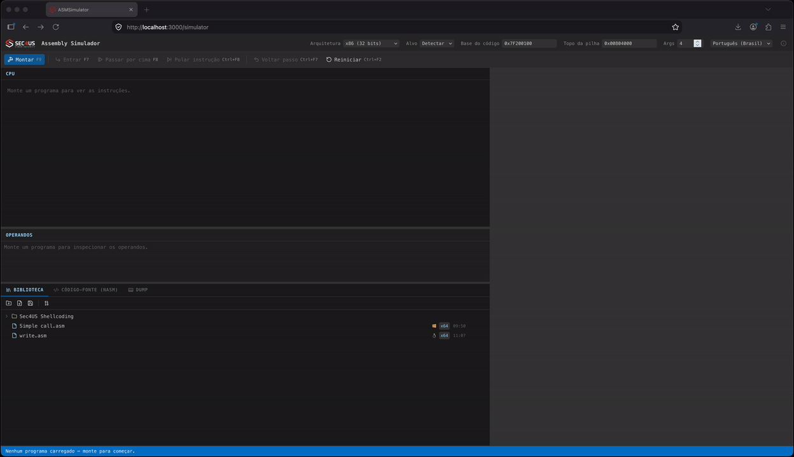

# ASMSimulator

Um simulador de Assembly **para aula**: escreva x86 ou x86-64, monte, e execute
uma instrução por vez vendo registradores, flags, pilha e memória mudarem a cada
passo — com o passo para trás disponível quando algo não fez sentido.



## O que isto é

Um simulador **acadêmico**. Ele não executa Assembly: as instruções são
interpretadas por um modelo de CPU escrito em JavaScript, para que se veja o
estado mudando passo a passo. O montador (`nasm`) e o desmontador (Capstone)
rodam no backend e só transformam texto em bytes e bytes em instruções — em
nenhum ponto o código do aluno roda de verdade.

A leitura de tela é a de um debugger, porque é essa a leitura que se quer
ensinar: desmontagem à esquerda, registradores e pilha à direita, o código-fonte
embaixo, e o painel de operandos dizendo, **antes** de executar, quais endereços
a instrução toca e que valor vai ficar em cada um.

## O que isto não é

Não é um validador de código, um emulador nem um ambiente de execução. Apenas
parte do conjunto de instruções é coberta, chamadas de sistema não são
executadas de verdade, e um programa que funciona aqui pode se comportar de
outro jeito numa máquina real — e vice-versa. **Nunca tome um resultado deste
simulador como prova de que um programa está correto.**

O simulador é honesto sobre isso na própria interface: uma syscall sem
simulação avisa que foi pulada, e uma que ele reproduz avisa que o valor de
retorno é convenção dele, não resultado de kernel nenhum.

## Como rodar

Pré-requisitos: **Docker** e **Docker Compose**. Nada mais — nem Python, nem
Node, nem `nasm` na máquina.

```bash
cp .env.example .env      # obrigatório: o compose lê este arquivo
docker compose up -d --build
```

Abra **`http://localhost`**.

O `.env` copiado já sobe funcionando; mexa nele só para mudar a porta
(`HTTP_PORT`), o caminho do admin (`ADMIN_URL`) ou a marca. Sem o arquivo, o
`docker compose` recusa a subir — ele é declarado como `env_file` e não é
versionado.

O primeiro boot cria o banco SQLite e a `SECRET_KEY` no volume de dados e roda
as migrations sozinho. Depois disso:

```bash
docker compose logs -f backend   # acompanhar o log (sai tudo no stdout)
docker compose down              # parar, preservando a biblioteca de programas
docker compose down -v           # parar e APAGAR os dados
```

O ambiente roda **offline**: fonte, ícones e imagens estão embarcados na
imagem, e nada é buscado na rede em tempo de execução.

### Depois de mudar o código

O frontend é compilado dentro da imagem do nginx, então uma alteração em
`frontend/` só aparece depois de reconstruir:

```bash
docker compose up -d --build
```

### Desenvolvimento

Sobe o React com hot-reload e o Django com auto-reload:

```bash
docker compose -f docker-compose.dev.yml up
```

- App: `http://localhost:3000`
- API: `http://localhost:8000`

Não há Node nem Python no host: para rodar testes ou lint, use um container
descartável na mesma imagem do build.

```bash
docker run --rm -v "$PWD/frontend":/app -w /app -e CI=true node:20-alpine \
  ./node_modules/.bin/craco test          # frontend

docker run --rm --entrypoint python -e PYTHONPATH=/app -v "$PWD/backend":/app \
  -w /app asm_simulator-backend manage.py test asm_simulator   # backend
```

## O que dá para fazer

- **Montar e executar** x86 (32 bits) e x86-64, com alvo Linux, Windows ou
  macOS — o alvo decide a tabela de syscalls, e o mesmo número em `EAX` resolve
  para funções diferentes em cada um.
- **Passo a passo** com os atalhos do x64dbg: `F7` entra, `F8` passa por cima,
  `F9` monta, `Ctrl+F7` desfaz o passo, `Ctrl+F2` reinicia.
- **Ver a memória** no painel de dump: seleção por clique ou arrasto, cópia dos
  bytes em hexadecimal, `\x..` ou `db 0x..` — as formas em que um trecho volta
  para dentro de um programa. Clique direito em qualquer valor de registrador,
  pilha ou argumento leva o dump até ele.
- **Ler um ponteiro como estrutura**: um `RCX` que vale `0x7FF7…` vira um
  `OBJECT_ATTRIBUTES` com os campos abertos, seguindo a cadeia de ponteiros.
- **Nomear a função de um `call`**, com auto-completar sobre o catálogo de
  protótipos; rótulos escritos no próprio fonte já entram nomeados sozinhos.
- **Importar um binário cru** e recebê-lo como `.asm` editável, ou importar uma
  `ntdll.dll` para resolver os SSN de um alvo Windows.
- **Guardar programas** numa biblioteca de pastas e arquivos, exportável e
  importável como um bundle.

Toda a interface existe em **inglês e português**, com o inglês como padrão e
fallback; o idioma inicial vem do navegador.

## Stack

| Camada    | Tecnologia                                              |
|-----------|---------------------------------------------------------|
| Backend   | Django 5.2 + DRF, uWSGI — `nasm` (montar) e Capstone (desmontar) |
| Frontend  | React 19 (CRA/craco), TailwindCSS — e o interpretador de CPU |
| Banco     | SQLite (WAL), em volume gerenciado pelo Docker          |
| Proxy     | nginx, **HTTP puro** — sem TLS                          |
| Acesso    | Público — sem autenticação                              |

```
backend/    core/ (settings, wsgi) + asm_simulator/ (views, services, prototypes)
              services/assembler.py     texto NASM  -> bytes (+ mapa de linhas e seções)
              services/disassembler.py  bytes       -> instruções (Capstone)
frontend/   src/lib/cpu/    o interpretador: registradores, flags, memória, syscalls
            src/components/debugger/   os painéis (desmontagem, pilha, dump, …)
nginx/      Dockerfile (compila o frontend) + nginx.conf
docker-compose.yml       produção (backend + nginx)
docker-compose.dev.yml   desenvolvimento (hot-reload)
.env.example             template do .env ÚNICO — nunca versione o .env real
```

> As convenções obrigatórias do projeto estão em [`CLAUDE.md`](./CLAUDE.md).
> Todo identificador de código é escrito em **inglês**.

## Acesso, admin e segurança

O sistema é **100% público**: nenhuma tela, rota ou endpoint pede credencial —
sem login, token ou sessão de usuário final. É um simulador que o aluno roda na
própria máquina.

O `/admin/` do Django existe como ferramenta de manutenção e entra **sempre
autenticado**, sem senha. **Quem alcança a URL do admin tem acesso total de
leitura e escrita ao banco.** Publique o serviço apenas onde isso for aceitável;
para restringir, troque `ADMIN_URL` por um caminho não óbvio e limite o acesso
no nginx.

O nginx serve **somente HTTP**. Precisando de HTTPS, termine o TLS num
proxy/CDN na frente: o backend confia em `X-Forwarded-Proto`/`X-Forwarded-Host`
e os links absolutos saem como `https` mesmo recebendo HTTP neste hop. Se o
domínio ou a porta vistos pelo navegador diferirem do que o Django recebe,
defina `CSRF_TRUSTED_ORIGINS` no `.env`.

## Configuração

Existe **um único `.env`, na raiz**, consumido pelos compose e pelo backend.
Nunca versione o `.env` — só o `.env.example`. O que mais se mexe:

| Variável              | Padrão   | Para quê                                    |
|-----------------------|----------|---------------------------------------------|
| `HTTP_PORT`           | `80`     | Porta publicada pelo nginx                  |
| `ADMIN_URL`           | `admin`  | Caminho do Django admin                     |
| `LOG_LEVEL`           | `INFO`   | Log da aplicação (sai no stdout)            |
| `DEBUG`               | `False`  | Ligar exige ação explícita                  |
| `REACT_APP_BRAND_*`   | —        | Marca; **vazio = usa a arte local**         |

## API

O backend não executa nada: prepara programas e serve catálogos.

| Rota                          | O que faz                                       |
|-------------------------------|-------------------------------------------------|
| `POST /api/program/assemble/` | Fonte NASM → bytes, instruções, mapa de linhas e seções |
| `POST /api/program/disassemble/` | Bytes → instruções (usada também na remontagem de código automodificável) |
| `POST /api/program/import/`   | Binário cru → `.asm` editável, com análise de plausibilidade |
| `GET  /api/prototypes/`       | Protótipos de syscalls e funções                |
| `GET  /api/types/`            | Layout de structs, para ler um ponteiro         |
| `/api/ntdll/`                 | `ntdll.dll` importada → SSN por nome (GET/POST/DELETE) |
| `/api/library/…`              | Biblioteca de programas: CRUD, export e import  |

## Banco e volumes

**SQLite** em `<DATA_DIR>/db.sqlite3` (`/app/data/db.sqlite3` no container), com
`journal_mode=WAL` e `timeout=20` para suportar os workers do uwsgi;
`SQLITE_PATH` sobrescreve o caminho. A persistência fica em **volume gerenciado
pelo Docker**, sem bind-mount: `asm_simulator_data` em produção,
`asm_simulator_data_dev` em desenvolvimento.

```bash
docker volume ls | grep asm_simulator
```
